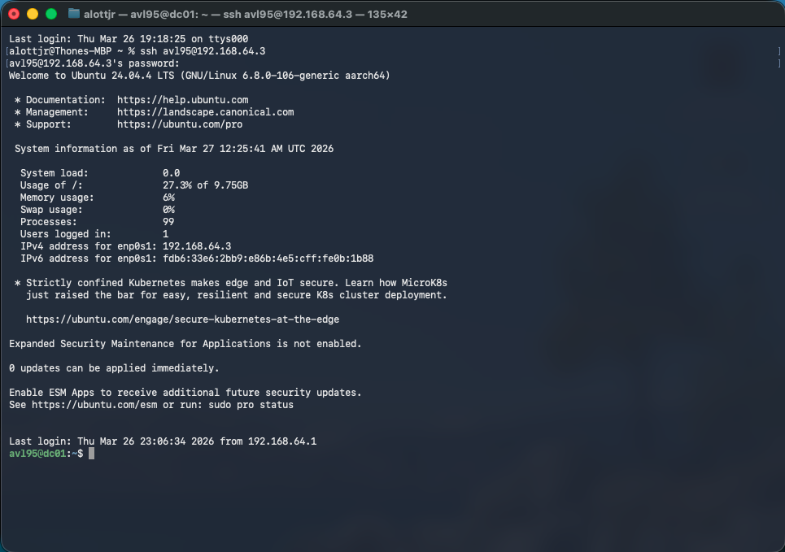
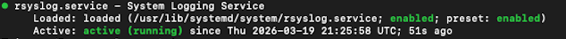
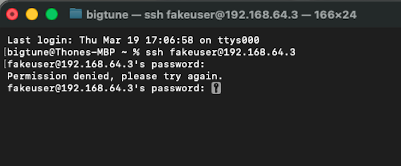
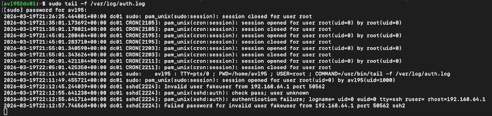

# Linux Log Monitoring & SSH Attack Detection Lab

## Overview
In this lab, I deployed a Linux server and monitored authentication logs to detect unauthorized SSH login attempts.

---

## Environment
- Ubuntu Server 24.04 (UTM VM)
- SSH Remote Access from macOS
- rsyslog for log management

---

## Steps Performed

1. Connected to Linux server via SSH
2. Verified logging service (rsyslog)
3. Monitored authentication logs using:

   ```
   sudo tail -f /var/log/auth.log
   ```
4. Simulated an attack using:

   ```
   ssh fakeuser@192.168.64.3
   ```
5. Detected failed login attempts in logs
---

## Screenshot Evidence

### 1. SSH Login



### 2. Logging Service Verification



### 3. Attack Simulation



### 4. Log Detection



